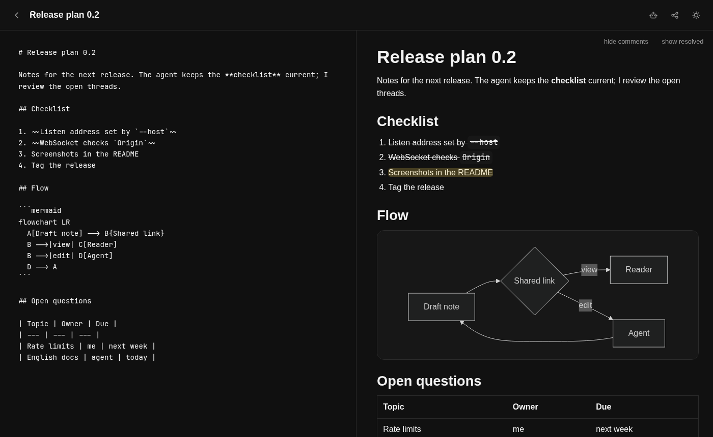
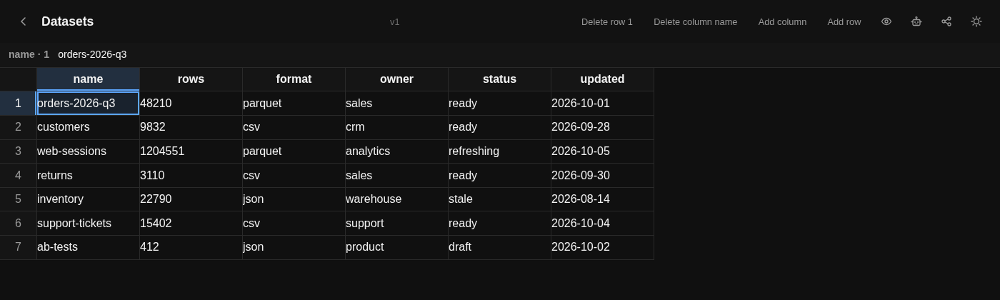

# jotpy

A small self-hosted server for notes and tables that a person edits in the browser while an agent works on them over HTTP. Both can be shared by link, and notes take comments.





## Relation to jot

jotpy started as a Python port of [jot](https://github.com/badlogic/jot) by Mario Zechner, and the browser client in `public/` still comes from it. On top of jot it adds tables with a small `SELECT` query language and CSV import and export, and share links that are signed, expire daily (or never, as a permalink) and can be revoked by rotating them. Agents get a skill served by the instance instead of jot's CLI. There is no CLI and no Docker setup.

The order of characters in the collaborative editor is kept by a simplified version of [articulated](https://github.com/mweidner037/articulated) by Matthew Weidner: a plain array with splice and the same `save()` format as `IdList` 1.3.1, not its tree.

## Install

Requires Python 3.13 and [uv](https://docs.astral.sh/uv/).

```bash
uv sync
```

## Run

```bash
uv run jot
uv run jot --host=127.0.0.1 --port=3210 --data=./data
```

Then open `http://localhost:3210`.

| option | variable | default |
| --- | --- | --- |
| `--host=` | `HOST` | `0.0.0.0` |
| `--port=` | `PORT` | `3210` |
| `--data=` | `DATA_DIR` | `./data`, relative to the current directory |

For use on your own machine only, or behind a reverse proxy, pass `--host=127.0.0.1`.

## Access

An instance has a single owner. The first visit sets the owner password, and the browser then keeps a session in a cookie. Until the password is set, whoever opens the page first becomes the owner, so do not expose a fresh instance.

An agent signs in as the owner with an API key in the `Authorization: Bearer <key>` header. The owner manages keys in the settings dialog, or through `GET`, `POST` and `DELETE /api/keys`.

Anyone without the password or a key sees only what the owner shares by link.

## Data and backups

Everything lives in the data directory (`--data`), as plain files:

| path | contents |
| --- | --- |
| `notes/<id>.md` | the note's markdown, a readable copy |
| `notes/<id>.json` | title, sharing, comments and the collaborative editing state |
| `sheets/<id>.json` | the table: columns, rows, sharing, version |
| `sheets/<id>.csv` | a CSV copy of the table for reading |
| `auth.json` | hashes of the owner password, browser sessions and API keys |
| `link.key` | the key that signs share links |

The server loads everything into memory on start and writes the files of a note or table each time it changes. A note's text comes from the editing state in its `.json`; the `.md` next to it is written from that state, and editing it by hand has no effect. Do not change files while the server runs, as it overwrites them.

To back up, copy the whole data directory. A copy taken while the server runs can catch a file halfway through a write, so for a clean copy stop the server first. To restore, put the directory back and start the server.

Keep `link.key` private: with it anyone can make share links. Losing it invalidates every share link issued so far; the server makes a new key on the next start.

## Notes

A note is markdown with a title. Its id has five characters `0-9a-z` and is shared with tables.

The browser editor handles several people at once. Changes travel over a WebSocket and everyone sees the others' cursors. The server renders the markdown preview; the browser draws `mermaid` blocks.

The owner has these endpoints:

| call | what it does |
| --- | --- |
| `GET /api/notes?q=` | list of notes, optionally searched in title and text |
| `POST /api/notes` | new empty note |
| `GET /api/notes/:id` | the whole note; with `offset` and `limit` only numbered lines |
| `PUT /api/notes/:id` | replaces `title`, `markdown` or `shareAccess`; `rotateShare: true` issues new links, `renewLink: true` moves the end of the daily link |
| `DELETE /api/notes/:id` | deletes the note |
| `POST /api/notes/:id/edit` | targeted text edits, see below |

An edit is `{"edits": [{"oldText": "...", "newText": "..."}]}`. `oldText` is an exact piece of the markdown and must occur in the note exactly once. Edits apply in order, and if one fails none is saved. Open editors get the change at once, without the whole text being replaced.

### Comments

A comment is a thread anchored to a piece of text: `quote` together with its surroundings in `prefix` and `suffix`, so the piece is found again after edits. Messages in a thread can be answered. A thread is resolved or deleted by the owner or by someone who wrote in it. People who comment through a link enter a name, and the server remembers it in a cookie.

### Sharing

A note has a sharing level of `none`, `view`, `comment` or `edit`. The link `/s/<ticket>` carries the id, the level, a generation and the day it expires, and is signed with `link.key`. Sharing has two links with the same level:

- the daily link (`shareUrl`) is valid until the end of the next UTC day, so 24 to 48 hours. Its last day is in `shareExpires`. `renewLink: true` moves it to tomorrow; the Share dialog does that each time it opens.
- the permalink (`sharePermalink`) has day 4095 and never expires. It belongs in the configuration of an agent that works with the note or table regularly, and should be kept like a password.

Changing the level or the "rotate links" button (`rotateShare: true`) raises the generation and both links stop working. The generation never goes back to zero: after 255 changes the server refuses further ones with `409` and sharing can only be turned off. Responses under `/api/share/<ticket>` carry `linkExpires`, the last day of the link used, or `null` for a permalink. For a table as CSV it is the `X-Jot-Link-Expires` header with a date or `never`. The shared page shows the expiry in its header.

The same API is available through a link under `/api/share/<ticket>/…`: reading, text edits (`edit`) and comments (`comment` and above).

## Tables

Next to notes, tables live in `sheets/<id>.json`. A cell is text. Tables can be shared for `view` or `edit`, with the same links as notes. A new table is shared for `edit` right away, so an agent can fill it at once.

Reading is `GET /api/sheets/:id/data`, optionally with `q` (a single `SELECT` statement) and `format=csv`. JSON returns the names of the selected columns in `columns`, their ids in `columnIds`, and rows with an `id` field. An empty table is filled by `POST /api/sheets/:id/import-csv`. Writing is a batch `POST /api/sheets/:id/ops` with the body `{"baseVersion": 12, "ops": [...]}`. The grid in the browser sends the same operations over the WebSocket. One bad operation fails the whole batch.

| `op` | fields |
| --- | --- |
| `insert_column` | `name`, optionally `before` (column id, otherwise at the end) |
| `rename_column` | `name`, `newName` |
| `delete_column` | `name` |
| `move_column` | `name`, optionally `before` (column id, otherwise at the end) |
| `resize_column` | `name`, `width` (integer 40–2000 px, `null` restores the default width) |
| `insert_row` | optionally `before` (row id, otherwise at the end), optionally `values` by column name |
| `delete_row` | `row` |
| `move_row` | `row`, optionally `before` (row id, otherwise at the end) |
| `set` | `row`, `column`, `value` |

`row` is a row id, or a condition `{"column": "sku", "value": "ABC"}` that must match exactly one row. `name` and `column` are column names.

`set` and `delete_row` return a 409 conflict when the affected cell changed after `baseVersion`. `insert_column`, `rename_column` and `delete_column` pass only on the current version. Moves and widths do not check the version. The width is stored with the column as `width` and goes into neither the CSV nor queries.

Above 2000 rows the grid does not open in the browser, and the table can only be read by a query with `WHERE` or `LIMIT`.

## Agents

The server serves a skill for agents at `/skill/jot/SKILL.md` (the source is in `skill-jot/`). It describes working with a note or table through a share link. The Share dialog in the editor and in the grid has a "for agent" button for both the daily link and the permalink, which copies a text for the agent: the skill's address and the link. The robot icon opens that dialog for the owner. On a shared page the robot icon shows the same text with the link the visitor used.

## Security

Pages are sent with a `Content-Security-Policy` that allows only the app's own scripts, with `X-Content-Type-Options: nosniff`, and with `Referrer-Policy: no-referrer`, so a link clicked in a shared note does not leak the share ticket. The WebSocket refuses connections whose `Origin` is another site.

## Tests

```bash
uv run pytest
```

## License

MIT, see `LICENSE`. The bundled [Mermaid](https://github.com/mermaid-js/mermaid) 11.14.0 in `vendor/mermaid/` is MIT licensed, see `vendor/mermaid/LICENSE`.
